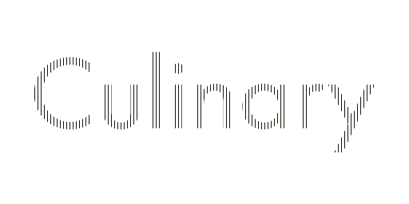

Add advanced command-line interface to your NodeJS program with **Culinary**!
======
**Culinary** is an advanced module that mostly takes care of all ANSI tasks of NodeJS using a common programming interface. The main purpose of this package is to serve [herb](http://www.npmjs.com/package/herb) for low-level console manipulation so I highly recommend that you check it out but if you need direct access to the CLI without any layers on top then Culinary is for you!

## Installation
```javascript
npm install culinary --save
```

## Usage
```javascript
var culinary = require('culinary');
var style = culinary.style;

// Get screen dimensions using .size or .dimensions
var screen = culinary.size();

// Save cursor position
culinary.save();
// Move cursor to the first visible line and erase that line (Commands can be chained)
culinary.position(0, 0).eraseLine();

// Write time in bold green and restore cursor
culinary.write(style((new Date()).toString()).spice("green","bold")).restore();

```

## Methods
#### write(string:String) 
Similar to *console.log* but does not create a new line or accept more than a String argument. For more advanced writing check out [herb](http://www.npmjs.com/package/herb)

#### up(n:Integer), down(n:Integer), back(n:Integer), forth(n:Integer)
Allows you to move the cursor **n** number of times relative to its current position. Other aliases for *back* and *forth* are **left** and **right**.

#### scrollUp(), scrollDown()
Scrolls the content by a single line. Useful for modifications to native logs.

#### nextLine()
Moves to the next line. Similar behavior as "\n".

#### save(), restore()
Allows for saving and restoration of the current cursor position. There is currently no way (that I am aware of) that enables multiple saves and restoration. **Use it wisely!**

#### cursor(visible:Boolean), hideCursor(), showCursor()
Allows for manipulation of cursor state between **visible** & **hidden**.
**WARNING: If cursor state is not set to *visible* before the application is closed the cursor will remain hidden. This will have a negative User Experience effect. Use it at your own discretion**

#### clearScreen(direction:String), cls()
Allows for clearing content relative to the direction or entirely. **Direction** can be set **up**, **down** or **entire** to clear the entire console screen.

#### eraseLine(direction:String), clearLine(direction:String)
Allows for clearing line content relative to the direction or entirely. **Direction** can be set **left**, **right** or **entire** to clear the entire line.

#### bell() - Ring it!

## Colors & Spices
As an addition to **Culinary** you can add styles to Strings. Simply assign **culinary.style** and use the **.spice()** method or one of the aliases (addStyle, addStyles, setStyle, setStyles).

#### spice(color:String ... spice:String)
There are no limits to how many colors or spices you can add to a string as long as it matches one of the options below:

- **Colors:** Black, White, Green, Blue, Cyan, Magenta, Red, Yellow
- **Backgrounds:** bgBlack, bgWhite, bgGreen, bgBlue, bgCyan, bgMagenta, bgRed, bgYellow
- **Spices:** bold, underline, ~~strikethrough~~ *(barely supported by clients)*, italic, **hidden**, invert, reset

#### e.g.
```javascript
var culinary = require('culinary');
var style = culinary.style;

culinary.write(style("Super text!").spice("red","bold","bgWhite","italic")).nextLine();
```

## Contributing
If you are interested you can contact me directly at <info@schahriar.com>!

## License
MIT © Schahriar SaffarShargh <info@schahriar.com>
